# Building a CI/CD Pipeline for house price prediction
[](https://github.com/d-kleine/AZ_Build_CICD_Pipeline/actions/workflows/pythonapp.yml)

## Overview

This projects focused on the development of a Continuous Integration and Continuous Delivery (CI/CD) pipeline. The primary objective of this project is to create a CI/CD pipeline for a Python-based machine learning application that employs the Flask web framework. The project involves several key components and tools, such as Github, Github Actions, Azure Pipelines, Makefile, requirements.txt, and pre-trained machine learning models.

The project starts by building a Github repository from scratch, with the creation of a scaffolding to support CI/CD processes. To initiate the CI phase, the project employs Github Actions, where a Makefile, requirements.txt, and application code are utilized for tasks like code linting, testing, and installation. This initial cycle ensures that code quality and functionality are maintained throughout the development process.

The second major phase of the project is the implementation of Continuous Delivery to Azure App Service using Azure Pipelines. This step ensures that the application can be seamlessly deployed and updated in a production environment.

The application used for this project is a Python-based machine learning model, specifically, a pre-trained scikit-learn model. This model is designed to predict housing prices in Boston based on various features, such as average rooms in a home, highway access data, teacher-to-pupil ratios, and more. The dataset used for training the model originates from Kaggle.

The primary goal of this project is to operationalize a Python Flask application (provided as *app.py*) that serves predictions about housing prices through API calls. While the model in this case is designed for housing price prediction, the principles and techniques learned in this project can be applied to other pre-trained machine learning models, including those for image recognition and data labeling.

## Project Plan

### Trello project plan

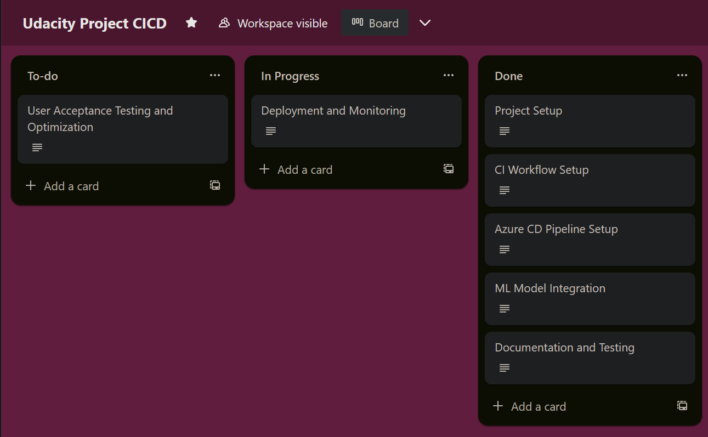

### Project Management spreadsheet that includes the original and final project plan


## Instructions

## Pipeline Architecture
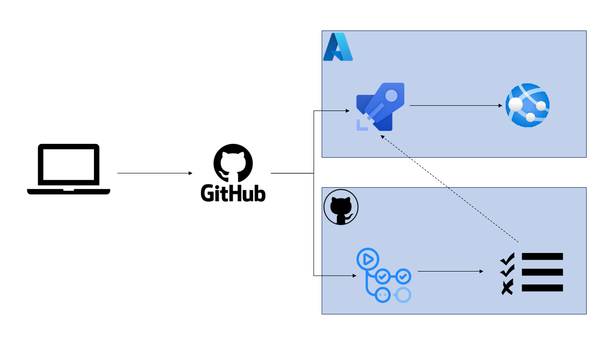

1. GitHub Repository:
   - Create a GitHub repository for the project.
   - Store project code and related files.

2. Flask Application and API:
   - Build the application using the Flask web framework.
   - Create an API within the Flask application to serve housing price predictions.

3. Continuous Integration (CI) with GitHub Actions:
   - Use GitHub Actions for CI.
   - Define tasks (linting, testing, and installation) in a Makefile.
   - Validate and test code changes before integration.

4. Continuous Delivery (CD) with Azure Pipelines:
   - Integrate the project with Azure Pipelines for CD.
   - Automate deployment to Azure App Service.
   - Automatically build, test, and deploy new code changes.

## Installation
1. Connect Github with Azure Cloud Shell
- SSH key generated:
```bash
ssh-keygen -t rsa
```
- Show and copy key:
```bash
cat ~/.ssh/id_rsa.pub
```
- Add new key to your GitHub profile (Settings => SSH keys > Add New)
- Clone repository from GitHub to Azure Cloud Shell
```bash
git clone ...
```
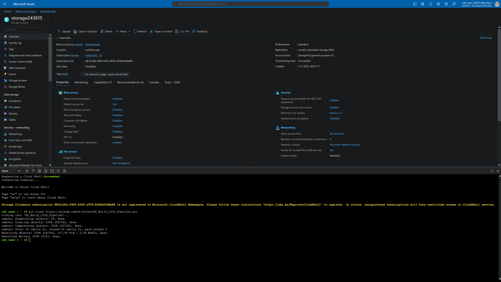

2. Run and deploy the project
- cd into the project directory
```bash
cd ...
```
3. Create venv `udacity-devops`
```bash
make setup
```
4. Activate venv `udacity-devops`:
```bash
source ~/.udacity-devops/bin/activate
```
- Run make file to install dependencies, test and lint files
```bash
make all
```
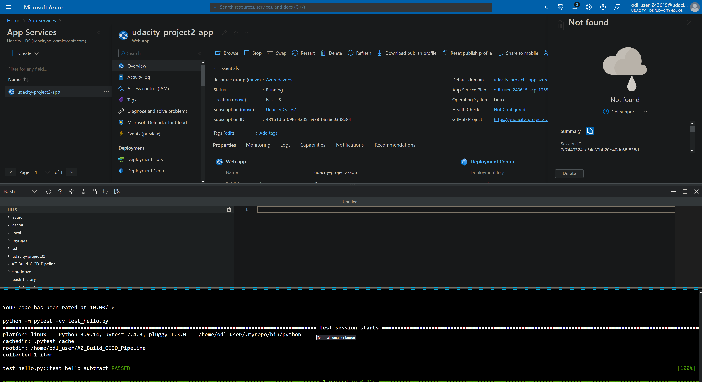
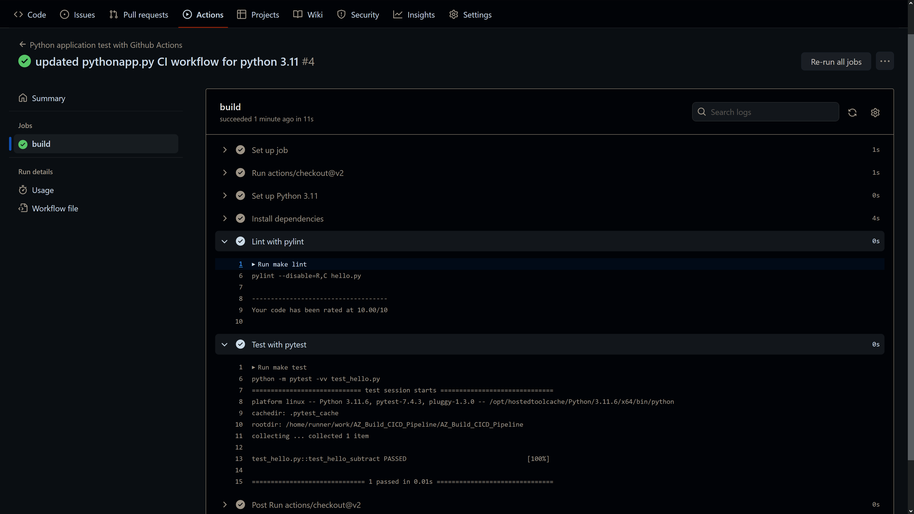

- Create an Azure App Service and deploy the the app on an endpoint

Run in the Azure command shell
```bash
chmod +x commands.sh
``` 

and then 
```bash
./commands.sh
``` 
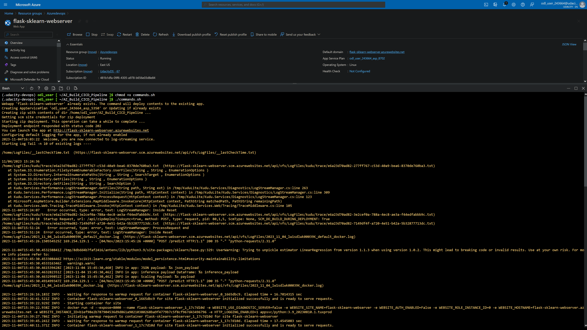

 Alternatively, you can adjust the deployment of the web app with customized settings in the Azure CLI like
```bash
az webapp up --name flask-sklearn-webserver --resource-group Azuredevops --sku B1 --logs --runtime "PYTHON:3.9"
```

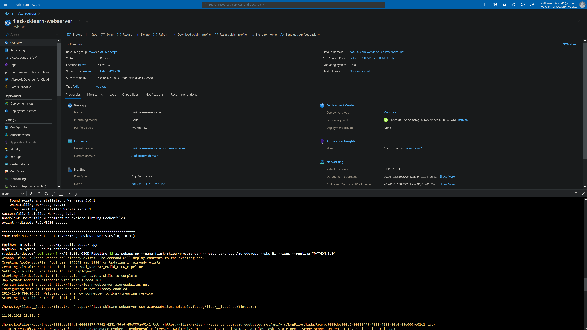
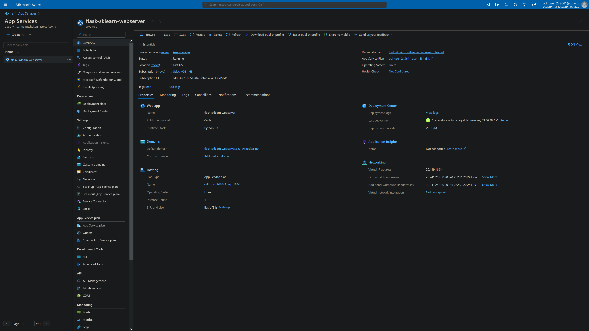

5. Double check the app service running

- Go to the Azure App Service url: https://flask-sklearn-webserver.azurewebsites.net
- Website showing "Sklearn Prediction Home" as success

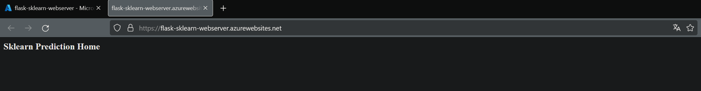

6. Run a script to predict

* First give write permissions:
```bash
chmod +x ./make_predict_azure_app.sh
```

* Then run the prediction:
```bash
./make-predict_azure_app.sh
```

The output should look like
```python
udacity@Azure:~$ ./make_predict_azure_app.sh
Port: 443
{"prediction":[20.35373177134412]}
```
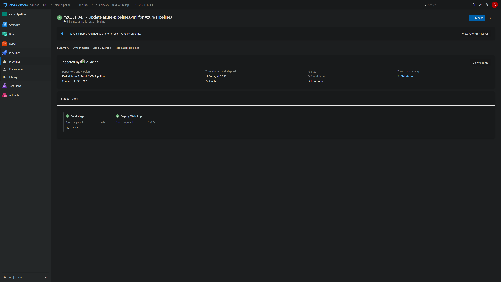
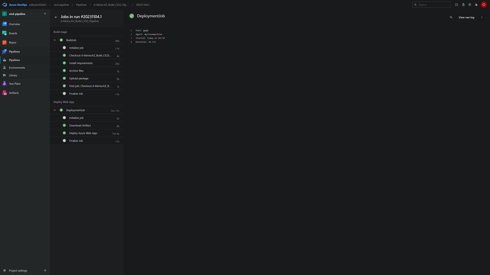
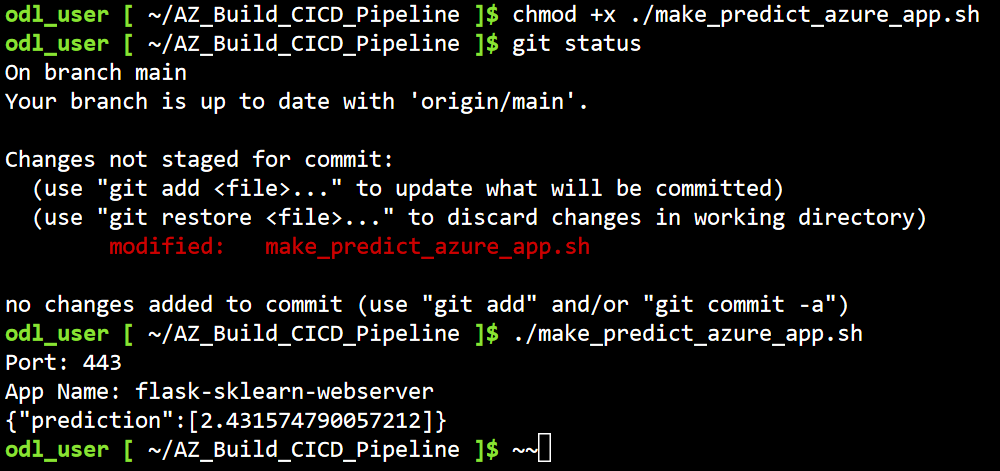
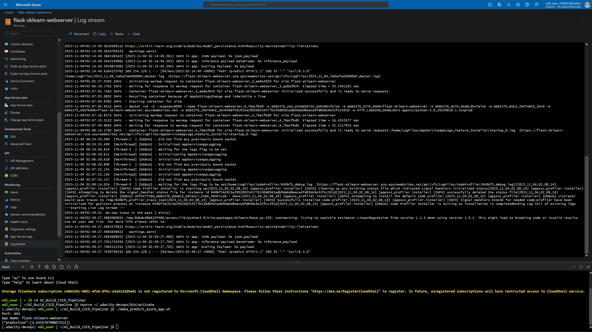

7. Load balancing test with *locust*
* Go to the project directory
* Run the script *locust.py* with
   ```bash
   locust
   ```
* Access link in web browser: http://localhost:8089
* Run and check report
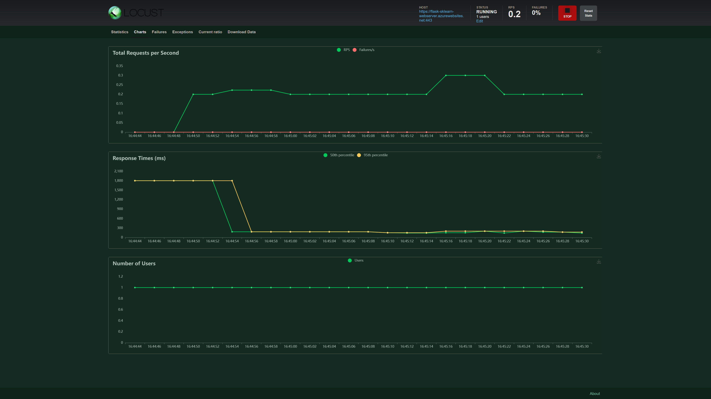

8. Destroy Azure resources after completion

## Enhancements

To improve the "Building a CI/CD Pipeline" project in the future, consider the following most important suggestions:

* **Documentation and Comments**: Enhance project documentation and code comments.
* **Unit Testing**: Expand test coverage, especially for the machine learning model and API.
* **Code Review Process**: Implement a code review process.
* **Security Measures**: Strengthen security practices, including input validation.
* **Containerization**: Containerize the application with Docker.
* **Orchestration**: Implement container orchestration (e.g., Kubernetes).
* **Performance Optimization**: Continuously monitor and optimize application performance.
* **CI/CD Pipeline Optimization**: Optimize the CI/CD pipeline for efficiency.
* **Scaling Strategy**: Plan for application scaling and resource allocation.
* **Backup and Disaster Recovery**: Implement a robust backup and recovery plan.